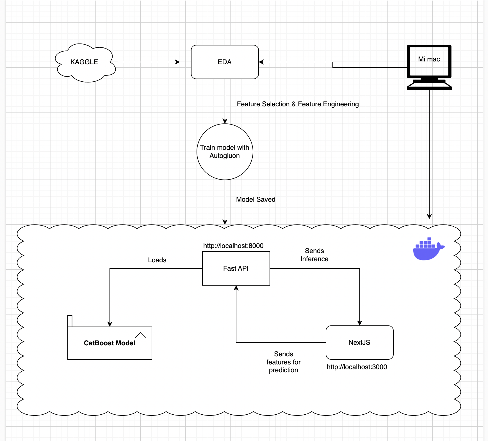

# **Tarea3MGE**

Este repositorio contiene código para entrenar un modelo de aprendizaje automático usando **AutoGluon**, incluyendo la preparación de datos, entrenamiento del modelo e inferencia.

## **Estructura del Proyecto**
```
Tarea3MGE/
│── data/
│   ├── raw/                     # Datos en bruto
│   │   ├── train.csv
│   │   ├── test.csv
│   ├── prep/                    # Datos preprocesados para entrenamiento
│   │   ├── train_preprocessed.csv
│   ├── inference/                # Datos preprocesados para inferencia
│   │   ├── test_preprocessed.csv
│   ├── predictions/              # Predicciones generadas por el modelo
│       ├── predictions.csv
│
│── notebooks/                    # Jupyter notebooks para exploración
│   ├── pipeline.ipynb
│
│── src/                           # Código fuente del proyecto
│   ├── script.py                  # Script principal que ejecuta todo el flujo
│   ├── prep.py                    # Preprocesamiento de datos (limpieza y transformación de los datos)
│   ├── train.py                   # Entrenamiento del modelo utilizando los datos preprocesados
│   ├── inference.py               # Generación de predicciones utilizando el modelo entrenado
│
│── models/                        # Modelos guardados
│
│── README.md                      # Documentación del proyecto
```

## **Descripción de los Scripts**
- **`script.py`**: Ejecuta todo el flujo de procesamiento de datos, entrenamiento del modelo e inferencia.
- **`prep.py`**: Realiza el preprocesamiento de los datos, asegurando que estén listos para el entrenamiento.
- **`train.py`**: Entrena el modelo de AutoGluon utilizando los datos preprocesados.
- **`inference.py`**: Toma un modelo entrenado y lo utiliza para generar predicciones sobre nuevos datos.

## **Instrucciones de Instalación**
### **1. Instalar Dependencias**
Asegúrate de tener **Python** instalado y luego instala los paquetes necesarios:
```bash
pip install autogluon pandas
```

### **2. Ejecutar el Script Principal**
Para ejecutar todo el flujo de preprocesamiento, entrenamiento e inferencia, simplemente ejecuta:
```bash
python src/script.py
```

## **Estilo de Código y Linting**
Para verificar la calidad del código con `pylint`, ejecuta:
```bash
pylint src/
```

## **Contribuir**
1. Haz un **fork** del repositorio.
2. Crea una rama de características (`git checkout -b nueva-caracteristica`).
3. Realiza tus cambios y haz un **commit** (`git commit -m 'Añadir nueva característica'`).
4. Sube los cambios (`git push origin nueva-caracteristica`).
5. Abre un **Pull Request**.

## **Arquitectura**

**En en este repo se entrega el modelo y en el repo referenciado por el diagrama abajo, esta la arquitectura**



**El repo con la arquitectura se encuentra en el siguiente link**

[Repository with App and Model](https://github.com/maudiaz221/tarea2MGE.git)

## **Licencia**
Este proyecto está bajo la Licencia MIT.
